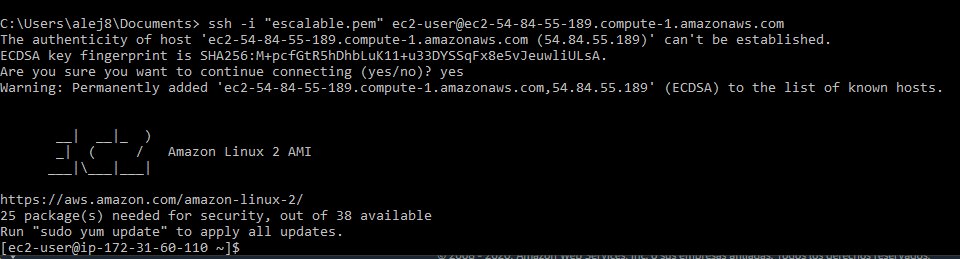

# Autoescalamiento


## Despliegue en CircleCi

[](https://app.circleci.com/pipelines/github/JulianGutierritos/AREP-LAB6)

## Prerrequisitos ##

La persona que quiera utilizar este programa debe tener conocimientos básicos en Java, Maven y AWS.

Para compilar y ejecutar este programa se debe contar con las siguientes herramientas: 

- Java 8
- Maven 


## Herramientas utilizadas para el desarrollo ##

Para el desarrollo de este programa se utilizó: 

- Java: Fue el lenguaje de programación utilizado para el desarrollo.

- Spark: Librería de Java que se utilizó para montar nuestra API REST.

- Maven: Fue la herramienta utilizada para la gestión y construcción del programa.

- CircleCi: Fue la herramienta de integración continua utilizada.

## Descripción ##

Este es un pequeño programa que permite a los usuarios calcular el minimo común multiplo y máximo común divisor de dos números naturales utilizando el método de euclides. Para utilizar este programa, el usuario debe mandar una solicitud GET con los dos numeros a calcular y recibira como respuesta la solución.

## Manual para volver nuestra solución elástica y con un alto desempeño utilizando AWS ##

1. Entre a AWS y cree una instancia Amazon Linux 2 


2. Deje las configuraciones por defecto y lancela

 

3. Cree un par de llaves con el nombre que quiera y descargelas. No puede perder esta llave, ya que esa es la que se va a usar para conectarse remotamente a la máquina.


4. Una vez la instancia haya sido creada, conectese a ella utilizando ssh.



5. Ahora, vamos a instalar Git en la instancia. Para esto, primero ejecutamos el siguiente comando: 

```
sudo yum update -y

``` 
Y luego, ejecutamos el siguiente comando: 

```
sudo yum install git -y
```

Podemos probar su correcta instalación utilizando el comando: 

```
git version
```


6. Clone el repositorio utilizando: 

```
git clone https://github.com/JulianGutierritos/AREP-LAB7-.git
```
y luego, muevase a la carpeta raíz del repositorio


## Licencia ## 

La licencia de este proyecto es: [**GNU General Public License v3.0**](LICENSE)

## Autor ##

Julián David Gutiérrez Vanegas
