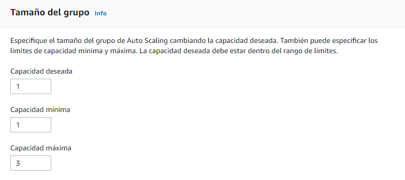
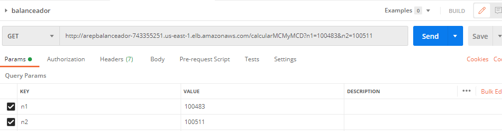

# Autoescalamiento


## Despliegue en CircleCi

[](https://app.circleci.com/pipelines/github/JulianGutierritos/AREP-LAB7-)

## Prerrequisitos ##

La persona que quiera utilizar este programa debe tener conocimientos básicos en Java, Maven y AWS.

Para compilar y ejecutar este programa se debe contar con las siguientes herramientas: 

- Java 8
- Maven 


## Herramientas utilizadas para el desarrollo ##

Para el desarrollo de este programa se utilizó: 

- Java: Fue el lenguaje de programación utilizado para el desarrollo.

- Spark: Librería de Java que se utilizó para montar nuestra API REST.

- Maven: Fue la herramienta utilizada para la gestión y construcción del programa.

- CircleCi: Fue la herramienta de integración continua utilizada.

## Descripción ##

Este es un pequeño programa que permite a los usuarios calcular el minimo común multiplo y máximo común divisor de dos números naturales utilizando el método de euclides. Para utilizar este programa, el usuario debe mandar una solicitud GET con los dos numeros a calcular y recibira como respuesta la solución.

## Instrucciones para su compilación, ejecución y generación de documentación ##

Para compilar el programa, se debe ubicar en la carpeta raíz y allí ejecutar el siguiente comando:

```
mvn package 
```

Una vez compilado el programa, lo siguiente es ejecutarlo. Para esto, digite el siguiente comando:

```
java -cp target/classes:target/dependency/* edu.eci.arep.Main
```
(Para el correcto funcionamiento del programa, ¿es importante que se ejcuten los dos)

 
(**NOTA:** Si se encuentra en un computador con SO Windows, el comando a utilizar es el siguiente:

```
java -cp target/classes;target/dependency/* edu.eci.arep.Main
```

si utiliza el otro comando estando en Windows, el programa no funcionará). 

Cuando ya tenga en ejecución el programa, ingrese a la siguiente url: 

```
https://localhost:5000//calcularMCMyMCD?n1=2&n2=10
```

Debería calcular el mínimo común múltiplo y máximo común divisor de 2 y 10

Si desea generar una nueva documentación del programa, debe ejecutar la siguiente lista de comandos:

```
   mvn javadoc:javadoc
   mvn javadoc:jar
   mvn javadoc:aggregate
   mvn javadoc:aggregate-jar
   mvn javadoc:test-javadoc
   mvn javadoc:test-jar
   mvn javadoc:test-aggregate
   mvn javadoc:test-aggregate-jar
```

Vale recalcar que el programa ya cuenta con archivos de documentación ubicados en la carpeta "Documentacion".


## Manual para volver nuestra solución elástica y con un alto desempeño utilizando AWS ##

1. Entre a AWS y cree una instancia Amazon Linux 2 


2. Deje las configuraciones por defecto y lancela

 

3. Cree un par de llaves con el nombre que quiera y descargelas. No puede perder esta llave, ya que esa es la que se va a usar para conectarse remotamente a la máquina.


4. Una vez la instancia haya sido creada, conectese a ella utilizando ssh.


5. Ahora, vamos a instalar Git en la instancia. Para esto, primero ejecutamos el siguiente comando: 

```
sudo yum update -y

``` 
Y luego, ejecutamos el siguiente comando: 

```
sudo yum install git -y
```

Podemos probar su correcta instalación utilizando el comando: 

```
git version
```


6. Clone el repositorio utilizando: 

```
git clone https://github.com/JulianGutierritos/AREP-LAB7-.git
```
y luego, muevase a la carpeta raíz del repositorio.

7. Instale java 8 en la máquina utilizando el comando: 

```
sudo yum install java-1.8.0
```

Verifique la instalación utilizando: 

```
java -version
```


8. Ejecute el programa ingresando el siguiente comando: 

```
java -cp target/classes:target/dependency/* edu.eci.arep.Main
```

Cuando lo ejecute, la consola debe mostrar lo siguiente:


Ahora oprima las teclas "CRTL" y "c" para dejar de ejecutarlo.

9. Ahora vamos a hacer que nuestro programa sea ejecutado siempre que la instancia sea inicada. Para esto, vamos a añadir el comando de ejecución en el archivo rc.local. 

Primero, ejecute el siguiente comado:

```
chmod +x /etc/rc.d/rc.local 
```

Después, modifique el archivo utilizando nano:

```
sudo nano /etc/rc.local
```

Vamos a agregar la siguiente linea al final: 

```
java -cp /home/ec2-user/AREP-LAB7-/target/classes:/home/ec2-user/AREP-LAB7-/target/dependency/* edu.eci.arep.Main
```

Podemos verificar que la linea fue correctamente escrita utilizando el siguiente comado: 

```
cat /etc/rc.local
```

Nos debería aparecer esto: 


10. En este paso, vamos a crear un grupo de seguridad en AWS. Para esto, nos dirigimos a "Security Groups" y le damos en el botón de "Crear un grupo de seguridad"


Allí le damos un nombre, una descripción y agremos una regla de entrada que permita el tráfico al puerto 5000 (puerto de nuestro programa), desde cualquier origen. Una vez hecho esto, creamos el grupo.


Luego, volvemos a nuestra instacia, damos click sobre ella y elegimos, en seguridad, la opción de agregar un nuevo grupo de seguridad


Allí, agregamos el grupo de seguridad que creamos anteriormente y guardamos 


11. Ahora, vamos a comprobar que nuestra máquina habilita al servicio al momento de iniciarse. Para esto, vamos a hacer la siguiente prueba: 

Primero, vamos a proceder a reinicar nuestra máquina. 

Después, vamos a ingresar al servicio. Para esto, ingrese a la siguiente url: 

```
http://<Ip de la maquina>:5000/calcularMCMyMCD?n1=8&n2=6 
```

Debería ver lo siguente: 


12. Ahora, vamos a proceder a crear una imagen de nuestra máquina. Para esto, vamos en la pagina de AWS donde está la instancia, la seleccionamos y elegimos la opción de crear una imagen.


Le ponemos un nombre, una descripción y la creamos 


13. Ahora, vamos a crear una configuración de lanzamiente. Para eso vamos a este panel y damos click en "Crear configuración de lanzamiento"


Le ponemos un nombre, elegimos la imagen que creamos anteriormente y seleccionamos la instancia t2.micro


Seleccionamos el grupo de seguridad que creamos y el launch-wizard, este último por si despues tenemos que conectarnos con SSH.


Elegimos el par de llaves creadas anteriormente y creamos la configuración. 


14. Luego, vamos a crear un balanceador de carga. Para eso, nos dirijimos a esa sección y le damos en "Create Load Balancer"


Allí, elegimos el balanceador de carga para aplicación (el primero)


Después, le damos un nombre y escogemos algunas subredes


Luego, en el paso 3, agregamos una regla de seguridad que permita el tráfico HTTP por el puerto 80 desde cualquier destino


A continuación, en el paso 4, adicionamos el target group. Le ponemos un nombre y le cambiamos el puerto al 5000, el cual es el puerto abierto en las imagenes. 


Deje las demás opciones por defecto y cree el balanceador

15. Finalmente, debemos crear el grupo de autoescalamiento. Para eso nos dirijimos a este panel y damos en "Crear grupo de autoescalamiento"


Primero, le damos un nombre y elegimos la configuación de lanzamiento creada anteriormente


Después, seleccionamos las subredes seleccionadas anteriormente en el balanceador


Luego, agregamos el target group creado anteriormente


A continuación, aumentamos la capacidad máxima a 3



Dejamos las demás opciones como están y creamos el grupo de Auto Scalling

16. Ahora realice una prueba. Si todo salió bien, debería poder conectarse con el balanceador. 

Utilice la dirección DNS dada por su balanceador. Puede acceder a ella seleccioando su balanceador y mirando el "DNS name" 


Luego, con esa dirección, acceda a la función utilizando el puerto 80. Si todo salió bien, debería observar esto: 


 
## Prueba de autoescalamiento ##

Para realizar estas pruebas, utilizamos la herramienta "postman" que nos permitía mandar muchas solicitudes GET en simultaneo. 

En esta herramienta, colocamos 5 solicitudes get en simultaneo para el cálculo del minimo común multiplo y máximo común divisor de dos números primos grandes: 100483 y 100511

``` 
/calcularMCMyMCD?n1=100483&n2=100511
```

Ahora, para realizar las pruebas nos dirigimos a la herramienta postman, y creamos una solicitud que utilice los números mencionados anteriormente:



Luego, agregamos la solicitud a una colección.


A continuación, damos click en "Run" y allí elegimos 100 iteraciones. 


Una vez terminada las iteraciones, observamos que nuestro grupo ahora cuenta con 3 instancias: 

 


Si vemos el historial de actividad en el grupo, se muestra que las instancias aumentaron de 1 a 3: 


 

## Licencia ## 

La licencia de este proyecto es: [**GNU General Public License v3.0**](LICENSE)

## Autor ##

Julián David Gutiérrez Vanegas
